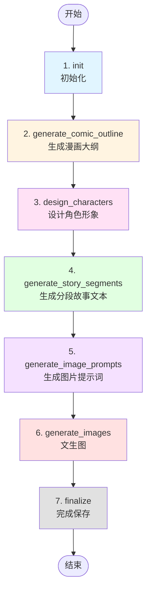

# 🎨 漫画生成 Agent 设计文档

## 📋 概述

本 Agent 用于根据用户输入自动生成漫画，包括故事文本分段和对应的漫画图片。

**核心目标**：
- 生成连贯的漫画故事文本
- 保证角色形象一致性
- 为每段文本生成对应的漫画图片
- 完整的创作流程自动化

---

## 🔄 LangGraph 工作流

### 流程图



### 节点说明

| 节点 | 功能 | 输入 | 输出 | LLM调用 |
|------|------|------|------|---------|
| **1. init** | 初始化环境和内存 | user_input, project_name | 初始化状态 | ❌ |
| **2. generate_comic_outline** | 生成漫画故事大纲 | user_input | comic_outline | ✅ |
| **3. design_characters** | 设计角色外观描述 | comic_outline | characters | ✅ |
| **4. generate_story_segments** | 生成分段故事文本 | outline, characters | story_segments | ✅ |
| **5. generate_image_prompts** | 为每段生成图片提示词 | segments, characters | image_prompts | ✅ |
| **6. generate_images** | 调用文生图API | image_prompts | images | 🎨 (图片API) |
| **7. finalize** | 保存结果到磁盘 | 全部数据 | 完成状态 | ❌ |

---

## 📊 State 状态定义

```python
class AgentState(TypedDict):
    """Agent 的状态定义"""

    # ========== 基础信息 ==========
    project_name: str          # 项目名称
    user_input: str            # 用户输入的漫画创意

    # ========== 流程状态 ==========
    current_step: str          # 当前执行的步骤名称
    completed_steps: list      # 已完成的步骤列表

    # ========== 创作内容 ==========
    comic_outline: dict        # 漫画大纲
    characters: list           # 角色设计列表
    story_segments: list       # 分段故事文本
    image_prompts: list        # 图片提示词列表
    images: list               # 生成的图片列表

    # ========== 控制流 ==========
    next_action: str           # 下一步动作
    error_message: str         # 错误信息
```

---

## 🎯 详细节点设计

### 节点 1: init（初始化）

**功能**：准备工作环境，初始化内存系统

**处理逻辑**：
1. 记录项目启动事件到 Episodic Memory
2. 设置 Working Memory（当前项目、状态）
3. 初始化 Profile Memory（项目偏好设置）
4. 设置初始状态

**Memory 操作**：
- Working Memory: 设置 `current_project`, `workflow_status`
- Episodic Memory: 记录 `workflow_start` 事件
- Profile Memory: 设置项目配置（风格、目标受众等）

**输出示例**：
```python
state = {
    "current_step": "初始化完成",
    "completed_steps": ["init"],
    ...
}
```

---

### 节点 2: generate_comic_outline（生成漫画大纲）

**功能**：根据用户输入，生成漫画故事大纲

**处理逻辑**：
1. 从 Profile Memory 获取用户偏好设置
2. 构建 LLM prompt：`根据创意生成漫画大纲，包括主题、情节、预计格数`
3. 调用 LLM 生成大纲
4. 解析返回结果为结构化数据
5. 保存到 Semantic Memory

**LLM Prompt 模板**：
```
你是一个专业的漫画编剧。请根据以下创意生成漫画故事大纲：

【创意】
{user_input}

【要求】
- 生成适合漫画表现的故事情节
- 包含明确的起承转合
- 预估需要的漫画格数（建议 4-8 格）
- 标注每格的关键情节点

【输出格式】
{
  "title": "漫画标题",
  "theme": "主题",
  "style": "风格（如日漫、美漫、简笔画）",
  "total_panels": 6,
  "plot_outline": "完整故事概要",
  "panel_breakdown": [
    {"panel_id": 1, "plot_point": "开场场景描述"},
    {"panel_id": 2, "plot_point": "发展..."},
    ...
  ]
}
```

**Memory 操作**：
- Semantic Memory: 保存 `comic_outline`
- Episodic Memory: 记录 `outline_created` 事件

**输出示例**：
```python
comic_outline = {
    "title": "时光旅行者",
    "theme": "科幻冒险",
    "style": "日漫",
    "total_panels": 6,
    "plot_outline": "主角发现祖父的时间机器...",
    "panel_breakdown": [
        {"panel_id": 1, "plot_point": "主角在阁楼发现日记"},
        {"panel_id": 2, "plot_point": "打开日记，看到时间机器草图"},
        ...
    ]
}
```

---

### 节点 3: design_characters（设计角色形象）

**功能**：设计漫画中的角色外观，确保后续生成图片时角色一致

**处理逻辑**：
1. 从 state 获取 comic_outline
2. 识别故事中的主要角色
3. 为每个角色生成详细的外观描述（用于文生图 prompt）
4. 保存到 Semantic Memory

**LLM Prompt 模板**：
```
你是一个专业的漫画角色设计师。请根据漫画大纲设计角色形象。

【漫画大纲】
{comic_outline}

【要求】
- 为每个主要角色设计详细的外观描述
- 描述要具体，包含：发型、服装、体型、面部特征、配色
- 描述需适合用于 AI 图片生成（Stable Diffusion, DALL-E 等）
- 保持风格统一

【输出格式】
[
  {
    "name": "角色名",
    "role": "主角/配角",
    "appearance": "详细外观描述（用于文生图 prompt）",
    "personality": "性格特点",
    "visual_tags": ["标签1", "标签2", ...]
  },
  ...
]
```

**Memory 操作**：
- Semantic Memory: 保存 `characters` 列表
- Episodic Memory: 记录 `characters_designed` 事件

**输出示例**：
```python
characters = [
    {
        "name": "林晨",
        "role": "主角",
        "appearance": "年轻男性，28岁，黑色短发，戴圆框眼镜，穿着休闲衬衫和牛仔裤，中等身材，眼神好奇而专注",
        "personality": "好奇心强、理性、有责任感",
        "visual_tags": ["black_hair", "glasses", "casual_shirt", "curious_expression"]
    },
    {
        "name": "林祖父（年轻版）",
        "role": "配角",
        "appearance": "25岁男性，1920年代复古装扮，西装背心，短发整齐，眼神坚定，英俊",
        "visual_tags": ["vintage_suit", "1920s_style", "determined_look"]
    }
]
```

---

### 节点 4: generate_story_segments（生成分段故事文本）

**功能**：根据大纲和角色，生成每格漫画的详细文本描述

**处理逻辑**：
1. 从 state 获取 comic_outline 和 characters
2. 遍历 panel_breakdown 中的每个格子
3. 为每格生成详细的场景描述、对话、动作
4. 保存到 Semantic Memory

**LLM Prompt 模板**：
```
你是一个专业的漫画分镜师。请根据大纲为每格漫画生成详细文本。

【漫画大纲】
{comic_outline}

【角色信息】
{characters}

【当前格子】
格子ID: {panel_id}
情节点: {plot_point}

【要求】
- 生成这一格的详细场景描述
- 包含角色动作、对话、表情
- 描述要适合漫画表现（视觉化）
- 字数控制在 50-100 字

【输出格式】
{
  "panel_id": 1,
  "scene_description": "场景描述",
  "characters_in_scene": ["角色1", "角色2"],
  "dialogue": "对话内容（如果有）",
  "action": "动作描述",
  "emotion": "情绪氛围",
  "text": "完整文本描述（50-100字）"
}
```

**Memory 操作**：
- Semantic Memory: 保存 `story_segments` 列表
- Episodic Memory: 记录 `segments_generated` 事件

**输出示例**：
```python
story_segments = [
    {
        "panel_id": 1,
        "scene_description": "阁楼内部，黄昏光线透过窗户",
        "characters_in_scene": ["林晨"],
        "dialogue": "",
        "action": "林晨在木箱中翻找，发现一本旧日记",
        "emotion": "好奇、惊讶",
        "text": "傍晚的阁楼里，林晨在整理祖父的遗物。他从旧木箱中拿出一本皮革日记，封面上布满岁月的痕迹。"
    },
    {
        "panel_id": 2,
        "scene_description": "特写：日记内页",
        "characters_in_scene": [],
        "dialogue": "林晨（旁白）：'这是...时间机器的设计图？'",
        "action": "翻开日记，看到手绘的时间机器草图",
        "emotion": "震惊、不可置信",
        "text": "日记中记载着复杂的物理公式和一台奇特机器的草图，日期标注为1924年。林晨的眼睛睁大了。"
    },
    ...
]
```

---

### 节点 5: generate_image_prompts（生成图片提示词）

**功能**：将每段文本转换为适合文生图 API 的 prompt

**处理逻辑**：
1. 从 state 获取 story_segments 和 characters
2. 遍历每个 segment
3. 结合角色外观描述，生成详细的图片 prompt
4. 包含：场景、角色、动作、风格、构图等要素

**LLM Prompt 模板**：
```
你是一个专业的 AI 绘画提示词工程师。请将漫画文本转换为文生图 prompt。

【漫画风格】
{comic_outline.style}

【角色外观】
{characters}

【当前格子文本】
{segment.text}

【场景描述】
{segment.scene_description}

【角色】
{segment.characters_in_scene}

【动作】
{segment.action}

【要求】
- 生成适合 Stable Diffusion / DALL-E 的英文 prompt
- 包含场景、角色、动作、光线、构图
- 如果有角色，必须包含该角色的详细外观描述（确保一致性）
- 指定漫画风格（manga style, comic style, etc.）
- 添加质量标签（high quality, detailed, etc.）

【输出格式】
{
  "panel_id": 1,
  "positive_prompt": "详细的正向提示词",
  "negative_prompt": "负向提示词（要避免的元素）",
  "style_tags": ["manga", "high_quality", ...]
}
```

**Memory 操作**：
- Semantic Memory: 保存 `image_prompts` 列表
- Episodic Memory: 记录 `prompts_generated` 事件

**输出示例**：
```python
image_prompts = [
    {
        "panel_id": 1,
        "positive_prompt": "Manga style, attic interior scene, golden hour sunset light through window, young man age 28, black short hair, round glasses, casual shirt and jeans, medium build, curious expression, discovering old leather diary in wooden box, dusty atmosphere, warm lighting, detailed, high quality, anime art style",
        "negative_prompt": "blurry, low quality, distorted, multiple heads, bad anatomy, western comic style",
        "style_tags": ["manga", "anime", "warm_lighting", "high_quality"]
    },
    {
        "panel_id": 2,
        "positive_prompt": "Manga style, close-up of old diary pages, yellowed paper, hand-drawn time machine blueprint, complex physics formulas, ink writing, date '1924' visible, aged paper texture, detailed illustration, high quality, sepia tones",
        "negative_prompt": "modern design, digital text, blurry, low quality",
        "style_tags": ["manga", "close_up", "vintage", "detailed"]
    },
    ...
]
```

---

### 节点 6: generate_images（文生图）

**功能**：调用图片生成 API，为每个 prompt 生成漫画图片

**处理逻辑**：
1. 从 state 获取 image_prompts
2. 遍历每个 prompt
3. 调用 image_client (DALL-E / Stable Diffusion / 通义万相)
4. 保存生成的图片到本地
5. 记录图片路径到 state

**API 调用**：
- 使用 `image_client.py` 中的 `ImageClient`
- 根据配置调用不同的图片 API
- 支持：DALL-E, Stability AI, DashScope（通义万相）

**处理逻辑（伪代码）**：
```python
def generate_images_node(self, state: AgentState) -> AgentState:
    image_client = get_image_client()
    images = []

    for prompt_data in state["image_prompts"]:
        # 调用文生图 API
        image_url = image_client.generate(
            prompt=prompt_data["positive_prompt"],
            negative_prompt=prompt_data["negative_prompt"],
            style=state["comic_outline"]["style"]
        )

        # 下载并保存图片
        image_path = save_image(
            image_url,
            filename=f"{state['project_name']}_panel_{prompt_data['panel_id']}.png"
        )

        images.append({
            "panel_id": prompt_data["panel_id"],
            "image_path": image_path,
            "image_url": image_url
        })

    state["images"] = images
    return state
```

**Memory 操作**：
- Semantic Memory: 保存 `images` 列表
- Episodic Memory: 为每张图片记录 `image_generated` 事件

**输出示例**：
```python
images = [
    {
        "panel_id": 1,
        "image_path": "output/时光旅行者_panel_1.png",
        "image_url": "https://..."
    },
    {
        "panel_id": 2,
        "image_path": "output/时光旅行者_panel_2.png",
        "image_url": "https://..."
    },
    ...
]
```

---

### 节点 7: finalize（完成保存）

**功能**：整理结果，保存到磁盘

**处理逻辑**：
1. 更新 Working Memory 状态为 "completed"
2. 统计完成信息（总格数、图片数量等）
3. 保存所有 Memory 到磁盘（JSON 文件）
4. 生成项目摘要

**Memory 操作**：
- Working Memory: 更新 `workflow_status` = "completed"
- Episodic Memory: 记录 `workflow_completed` 事件
- 调用 `memory.save_to_disk()` 保存所有内存

**输出示例**：
```python
state = {
    "current_step": "全部完成",
    "completed_steps": ["init", "generate_comic_outline", "design_characters",
                        "generate_story_segments", "generate_image_prompts",
                        "generate_images", "finalize"]
}
```

---

## 🗂️ Memory 系统使用

### Working Memory（工作记忆）
**用途**：存储当前会话的临时信息
```python
memory.working.set("current_project", project_name)
memory.working.set("workflow_status", "in_progress")
memory.working.get("workflow_status")
```

### Episodic Memory（情景记忆）
**用途**：记录创作过程中的事件日志
```python
memory.episodic.add_episode(
    event_type="outline_created",
    content=comic_outline,
    metadata={"title": comic_outline["title"]}
)
memory.episodic.get_recent_episodes(10)
```

### Semantic Memory（语义记忆）
**用途**：存储创作的知识和内容
```python
memory.semantic.update_knowledge("comic_outline", outline)
memory.semantic.add_to_list("story_segments", segment)
memory.semantic.get_knowledge("characters")
```

### Profile Memory（配置记忆）
**用途**：存储项目配置和用户偏好
```python
memory.profile.set_profile("project_name", "时光旅行者")
memory.profile.update_settings({
    "comic_style": "manga",
    "target_audience": "young_adult"
})
```

---

## 📁 文件结构

```
storybook/
├── agent_core.py           # LangGraph 工作流核心
├── tools.py                # 工具函数（LLM调用封装）
├── memory.py               # Memory 系统
├── llm_client.py           # LLM 客户端（HTTP请求）
├── image_client.py         # 图片生成客户端
├── config.py               # 配置管理
├── cli.py                  # CLI 交互界面
├── main.py                 # 主入口
└── memory_storage/         # Memory 持久化存储
    └── {project_name}.json
```

---

## 🚀 使用流程

### 1. 用户输入
```python
user_input = "一个关于时间旅行的科幻冒险故事，主角发现祖父的时间机器"
```

### 2. 启动 Agent
```python
agent = StoryCreationAgent(memory_system)
final_state = agent.run(
    project_name="时光旅行者",
    user_input=user_input
)
```

### 3. 自动执行流程
```
[init] → [outline] → [characters] → [segments] → [prompts] → [images] → [finalize]
```

### 4. 输出结果
```
output/
├── 时光旅行者_panel_1.png
├── 时光旅行者_panel_2.png
├── ...
└── 时光旅行者_panel_6.png

memory_storage/
└── 时光旅行者.json  # 完整的创作记录
```

---

## 🎨 优化建议

### 1. 角色一致性优化
- 使用 ControlNet / IP-Adapter 保持角色外观一致
- 在 image prompt 中严格使用相同的角色描述
- 可考虑先生成角色参考图，后续使用图生图

### 2. 故事分段优化
- 根据用户输入的长度动态调整格数（4-12格）
- 支持多种分段策略：情节分段、对话分段、固定格数

### 3. 图片质量优化
- 添加质量控制参数（分辨率、采样步数等）
- 支持图片后处理（裁剪、拼接、添加对话框）
- 实现图片审核机制（重新生成质量不佳的图片）

### 4. 并发优化
- 图片生成节点支持并发调用（多个 prompt 同时生成）
- 使用异步 API 调用提高效率

---

## 📝 配置示例

### .env 配置
```bash
# LLM 配置（用于生成文本）
LLM_PROVIDER=dashscope
DASHSCOPE_API_KEY=sk-xxx
DASHSCOPE_MODEL=qwen-max

# 图片生成配置
IMAGE_PROVIDER=dashscope
DASHSCOPE_IMAGE_MODEL=wanx-v1

# 或使用 OpenAI DALL-E
# IMAGE_PROVIDER=openai
# OPENAI_API_KEY=sk-xxx
```

---

## ✅ 完成标志

当 Agent 运行完成后：
1. ✅ 生成了完整的漫画大纲
2. ✅ 设计了角色外观
3. ✅ 生成了 N 段故事文本（N = total_panels）
4. ✅ 为每段生成了图片 prompt
5. ✅ 生成了 N 张漫画图片
6. ✅ 保存了完整的创作记录到 Memory

**输出文件**：
- `output/{project_name}_panel_{i}.png` - 漫画图片
- `memory_storage/{project_name}.json` - 创作记录（可用于继续创作、修改等）

---

## 🔧 后续扩展

1. **交互式编辑**：允许用户修改某格的文本或重新生成某格图片
2. **多风格支持**：支持切换不同漫画风格（日漫、美漫、水墨画等）
3. **对话框添加**：自动在图片上添加对话框和文字
4. **拼图功能**：将多格漫画拼接成完整的漫画页
5. **批量生成**：支持生成长篇漫画（多页）

---

**文档版本**: v1.0
**创建日期**: 2026-01-21
**作者**: Claude Code Assistant
